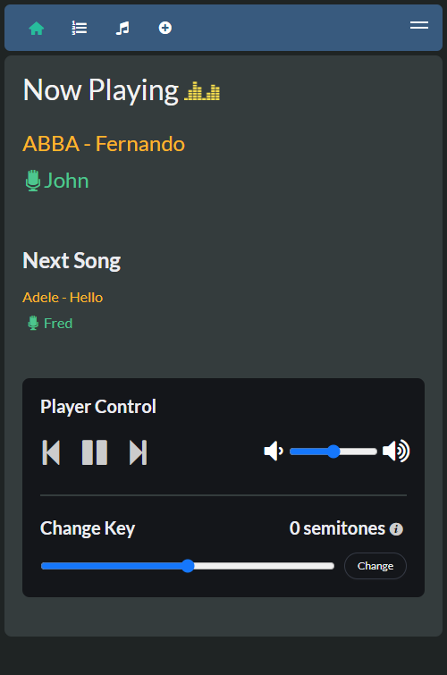
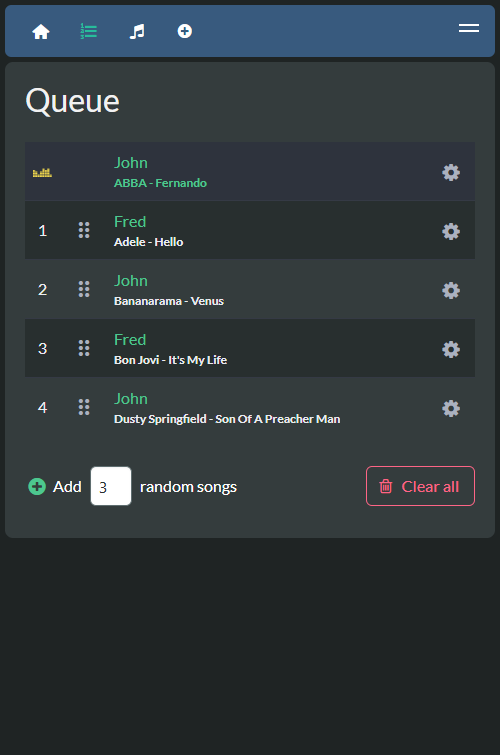
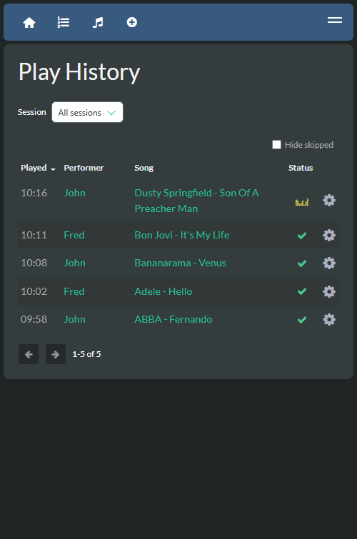
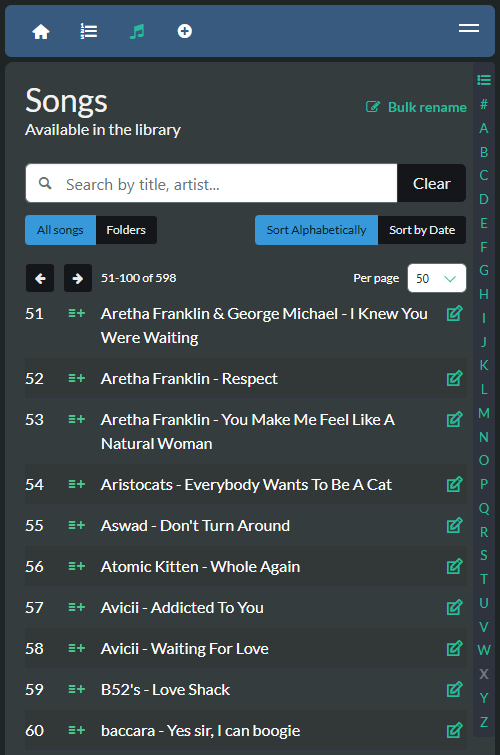
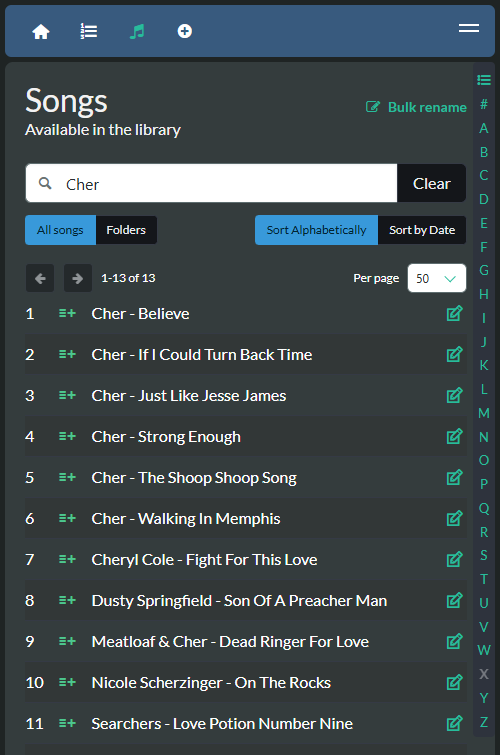

# PiKaraoke


PiKaraoke is a cross-platform karaoke server that brings the professional "KTV" experience to your home. It transforms your computer or Raspberry Pi into a dedicated karaoke station with a full-screen player and an instant web interface. Guests can join by simply scanning a QR code—no app downloads required—to browse your local library, manage the queue, and access countless karaoke hits from YouTube.

- 📱 Instant Mobile Remote: Search and queue songs from any smartphone—just scan and sing.
- 📺 Dedicated Player: High-performance splash screen that can be opened on any web browser for a true karaoke room feel.
- 🌐 YouTube & Local Media: Play your own files or access more from the web.
- 🎹 Live Pitch Shifting: Adjust the key of any song to match your vocal range.
- 🛠️ Admin Control: Manage the queue and settings via a password-protected admin mode.
- 📊 Session Management: Every night is recorded automatically—browse the play history, then see which songs and performers topped the charts.
- 🎯 Hyper-accurate vocal performance scoring system: (not really, it's random. But kind of fun!)
- 🐧 Lightweight & Versatile: Runs anywhere from a basic Raspberry Pi to a high-end PC.

Love PiKaraoke? This project is independently maintained and free for everyone to enjoy. If PiKaraoke has made your parties better and you'd like to help keep the project alive and growing, feel free to [buy me a coffee](https://www.buymeacoffee.com/vicwomg)! <br/><br/>
<a href="https://www.buymeacoffee.com/vicwomg" target="_blank"></a>

[](https://conventionalcommits.org)

## Table of Contents

- [Supported Devices / OS / Platforms](#supported-devices--os--platforms)
- [Quick Install](#quick-install)
- [Manual Installation](#manual-installation)
- [Usage](#usage)
- [Docker](#docker-instructions)
- [Screenshots](#screenshots)
- [Developing pikaraoke](#developing-pikaraoke)
- [Troubleshooting](#troubleshooting)

## Supported Devices / OS / Platforms

- OSX
- Windows
- Linux
- Raspberry Pi 4 or higher (Pi3 works ok with overclocking)

## Quick Install

For a streamlined installation that handles all dependencies (uv, ffmpeg, deno) and installs PiKaraoke, run the following in your terminal:

### Linux & macOS

```sh
curl -fsSL https://raw.githubusercontent.com/vicwomg/pikaraoke/master/build_scripts/install/install.sh | bash
```

### Windows (installer)

Download `PiKaraoke-<version>-setup.exe` from the [latest release](https://github.com/vicwomg/pikaraoke/releases) and run it. It adds Start Menu and desktop shortcuts.

Windows shows a blue "Windows protected your PC" screen because the installer is unsigned. Click **More info**, then **Run anyway**.

To uninstall, use **Settings > Apps**.

### Windows (PowerShell)

```powershell
irm https://raw.githubusercontent.com/vicwomg/pikaraoke/master/build_scripts/install/install.ps1 | iex
```

To uninstall, swap `install.ps1` for `uninstall.ps1`.

After installation, you can launch pikaraoke from the command line with `pikaraoke` or from a desktop shortcut. Re-running the above command will update a previous pikaraoke installation to the latest version.

Uninstalling removes the pikaraoke package and its shortcuts. Your songs, settings, ffmpeg, deno and uv are left in place.

## Manual installation (advanced users)

### Prerequisites

- A modern web browser (Chrome/Chromium/Edge recommended)
- Python 3.10 or greater: [Python downloads](https://www.python.org/downloads/)
- FFmpeg (preferably a build with lib-rubberband for transposing): [FFmpeg downloads](https://ffmpeg.org/download.html)
- A js runtime installed to your PATH. [Node.js](https://nodejs.org/en/download/) is most common, [Deno](https://deno.com/) is probably easiest for non-developers.

### Install the pikaraoke package

We recommend installing pikaraoke via [uv](https://github.com/astral-sh/uv).

```sh
uv tool install pikaraoke
```

You may alternately use the standard python `pip install pikaraoke` installer if you are familiar with virtual environments or you are not concerned with global package isolation.

## Usage

Run pikaraoke from the command line with:

```sh
pikaraoke
```

Launches the player in "headed" mode via your default browser. Scan the QR code to connect mobile remotes. Use `pikaraoke --headless` to run as a background server for external browsers.

See the help command `pikaraoke --help` for available options.

To upgrade to the latest version of pikaraoke, run:

```sh
uv tool upgrade pikaraoke
```

## Docker instructions

Run PiKaraoke in Docker using the command below. Note the requirements for port mapping, LAN IP specification, and persistent volume mounts (set to ~/.pikaraoke in the example for simplicity):

```sh
docker run -p 5555:5555 \
  -e TZ=Europe/London \
  -v ~/pikaraoke-songs:/app/pikaraoke-songs \
  -v ~/.pikaraoke:/home/pikaraoke/.pikaraoke \
  vicwomg/pikaraoke:latest \
  -u http://<YOUR_LAN_IP>:5555
```

Set `TZ` to your own timezone, taken from the "TZ identifier" column of the [tz database list](https://en.wikipedia.org/wiki/List_of_tz_database_time_zones).

For more information and a configurable docker-compose example, [see official Dockerhub repo](https://hub.docker.com/r/vicwomg/pikaraoke)

To run under a path prefix (e.g., `/karaoke`), add `--base-path /your-path` and set `-u` to the public origin. Example: `--base-path /karaoke -u https://example.com`. PiKaraoke will generate links under `/karaoke` automatically. For reverse proxy setups, the proxy must forward both HTTP and WebSocket traffic for that path to PiKaraoke. Path-based nginx-proxy setups typically also need `VIRTUAL_PATH=/karaoke` with `VIRTUAL_DEST=/`.

## Screenshots

<div style="display: flex; flex-wrap: wrap;">







</div>

## Developing pikaraoke

The Pikaraoke project utilizes `uv` for dependency management and local development.

- Install [uv](https://github.com/astral-sh/uv)
- Git clone this repo

From the pikaraoke directory:

```sh
# install dependencies and run pikaraoke from local code
uv run pikaraoke
```

See the [Pikaraoke development guide](https://github.com/vicwomg/pikaraoke/wiki/Pikaraoke-development-guide) for more details.

## Troubleshooting and guides

See the [TROUBLESHOOTING wiki](https://github.com/vicwomg/pikaraoke/wiki/FAQ-&-Troubleshooting) for help with issues.

There are also some great guides [on the wiki](https://github.com/vicwomg/pikaraoke/wiki/) to running pikaraoke in all manner of bizarre places including Android, Chromecast, and embedded TVs!
